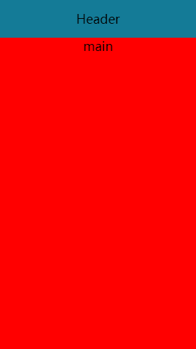

### 布局

#### 实现下列布局:Header 定高， Main 充满其他区域



```css
html,
body,
#app {
  position: relative;
  font-size: 24px;
  height: 100%;
  width: 100%;
}
.header {
  height: 3rem;
  text-align: center;
  line-height: 3rem;
  background-color: #147b97;
}
.main {
  position: absolute;
  left: 0;
  right: 0;
  bottom: 0;
  top: 3rem;
  background-color: red;
  text-align: center;
}
```
