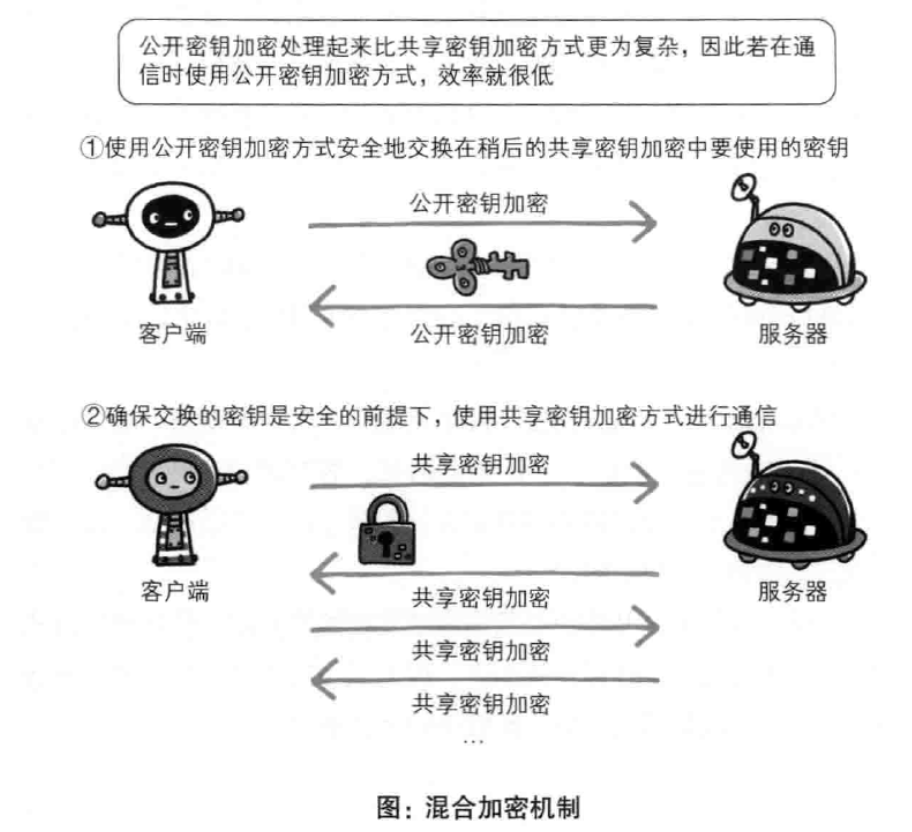
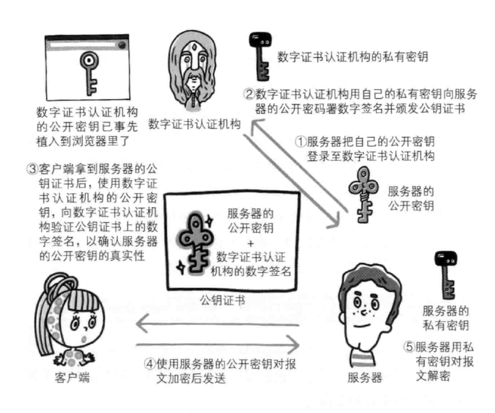

### Https

#### 共享密钥加密

+ 加密和解密用同一个密钥的方式称为共享密钥加密，也交对称密钥加密。
+ 以共享密钥方式加密时必须将密钥也发给对方，可究竟怎样才能安全地转交，在互联网上转发密钥时，如果通信被监听那么密钥怎么保证不被监听，存在一个悖论。

#### 公开密钥加密

+ 公开密钥加密使用一对非对称的密钥，一把是私钥，一把是公钥。使用公开密钥加密方式，发送密文方会使用对方的公开密钥进行加密处理，对方收到被加密的信息后，再使用自己的私钥进行解密。利用这种方式，不需要发送用来解密的私钥，也不必担心密钥被攻击者窃听而盗走。
+ 另外，要想根据密文和公开密钥，恢复到信息原文是异常困难的，因为解密过程就是在对离散对数进行求值，这很难办到（如果对非常大的整数做快速的因式分解，那可以破解）。
  
#### HTTPS采用混合加密机制

HTTPS采用共享密钥加密和公开密钥加密两者并用的混合加密机制。若密钥能够采用实现安全交换，那么有可能会考虑仅使用公开密钥加密来通信。**但是公开密钥加密与共享密钥加密相比，其处理速度要慢。所以使用公开密钥加密方式来交换密钥，之后建立通信交换报文阶段使用共享密钥加密方式。**

#### 证明公开密钥正确性的证书

+ 服务器运营人员向数字证书认证机构提交公开密钥申请，数字证书认证机构在判明提出申请者身份后，会对已申请饿公开密钥做数字签名之后分配这个已签名的公开密钥。并将该公开密钥放入公钥证书后绑定一起。
+ 服务器会将这份由数字证书认证机构颁发的公钥证书送给客户端，以进行公开密钥加密方式通信。公钥证书也可以叫做数字证书或者证书。
+ 接到证书的客户端可使用数字证书认证机构的公开密钥，对那张证书上的数字签名进行认证，一旦认证通过，客户端便可明确两件事：
  + 认证服务器的公开密钥是真实有效的数字证书认证机构
  + 服务器的公开密钥是值得信赖的
+ 此处认证机关的公开密钥必须安全地转交给客户端

