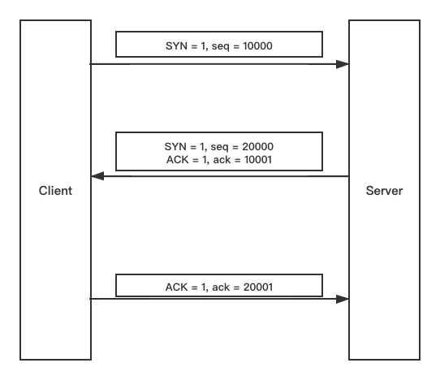
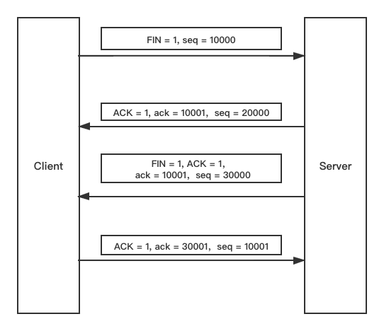

### TCP 协议

Transmission Control Protocol 传输控制协议

#### 位码（tcp标志位）

+ SYN(synchronous建立联机)
+ ACK(acknowledgement 确认)
+ PSH(push传送)
+ FIN(finish结束)
+ RST(reset重置)
+ URG(urgent紧急)
+ Sequence number(顺序号码)
+ Acknowledge number(确认号码)

#### 三次握手

流程图：

+ 客户端 向 服务器端 发送一个 SYN（SYN = 1,seq = 10000）包，请求一个主动打开。该包携带客户端为这个连接请求设定的随机数A作为消息列号。
+ 服务器端接收到一个 SYN 包后，把该包放入 SYN 队列中；回送一个SYN/ACK (SYN = 1,seq = 20000; ACK = 1,ack = 10001)。ACK的确认码应为A+1，SYN/ACK包本身携带一个随机产生的序号B。
+ 客户端收到 SYN/ACK 包后，发送一个 ACK (ACK = 1,ack = 20001) 的包，该包的序号被设定为A+1，而 ACK 的确认码为B+1。当服务器端收到这个 ACK 包的时候，把请求帧从 SYN 队列中移出，放置 ACCEPT 队列中。

#### 四次挥手

流程图：

