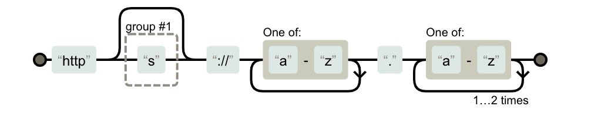

### RegExp

#### 一、[正则表达式测试工具](https://regexper.com)

eg: http(s)?:   \/\/[a-z]+\.[a-z]{2,3}
使用工具之后展示为：


#### 二、正则表达式元字符

| 字符        | 描述           |
|:-------------|:-------------|
| \ |将下一个字符标记为一个特殊字符、或一个原义字符、或一个 向后引用、或一个八进制转义符。例如，'n' 匹配字符 "n"。'\n' 匹配一个换行符。序列 '\\' 匹配 "\" 而 "\(" 则匹配 "("。 |
| ^ |匹配输入字符串的开始位置。如果设置了 RegExp 对象的 Multiline 属性，^ 也匹配 '\n' 或 '\r' 之后的位置。|
| $ |匹配输入字符串的结束位置。如果设置了RegExp 对象的 Multiline 属性，$ 也匹配 '\n' 或 '\r' 之前的位置。|
| * |匹配前面的子表达式零次或多次。例如，zo* 能匹配 "z" 以及 "zoo"。* 等价于{0,}。|
| + |匹配前面的子表达式一次或多次。例如，'zo+' 能匹配 "zo" 以及 "zoo"，但不能匹配 "z"。+ 等价于 {1,}。|
| ? |匹配前面的子表达式零次或一次。例如，"do(es)?" 可以匹配 "do" 或 "does" 。? 等价于 {0,1}。|
| {n} |n 是一个非负整数。匹配确定的 n 次。例如，'o{2}' 不能匹配 "Bob" 中的 'o'，但是能匹配 "food" 中的两个 o。|
| {n,} |n 是一个非负整数。至少匹配n 次。例如，'o{2,}' 不能匹配 "Bob" 中的 'o'，但能匹配 "foooood" 中的所有 o。'o{1,}' 等价于 'o+'。'o{0,}' 则等价于 'o*'。|
| {n,m} |m 和 n 均为非负整数，其中n <= m。最少匹配 n 次且最多匹配 m 次。例如，"o{1,3}" 将匹配 "fooooood" 中的前三个 o。'o{0,1}' 等价于 'o?'。请注意在逗号和两个数之间不能有空格。|
|?  |当该字符紧跟在任何一个其他限制符 (*, +, ?, {n}, {n,}, {n,m}) 后面时，匹配模式是非贪婪的。非贪婪模式尽可能少的匹配所搜索的字符串，而默认的贪婪模式则尽可能多的匹配所搜索的字符串。例如，对于字符串 "oooo"，'o+?' 将匹配单个 "o"，而 'o+' 将匹配所有 'o'。|
| . |匹配除换行符（\n、\r）之外的任何单个字符。要匹配包括 '\n' 在内的任何字符，请使用像"(.|\n)"的模式。|
|(pattern)|匹配 pattern 并获取这一匹配。所获取的匹配可以从产生的 Matches 集合得到，在VBScript 中使用 SubMatches 集合，在JScript 中则使用 $0…$9 属性。要匹配圆括号字符，请使用 '\(' 或 '\)'。|
|x\|y|匹配 x 或 y。例如，'z|food' 能匹配 "z" 或 "food"。'(z|f)ood' 则匹配 "zood" 或 "food"。|
|[xyz]|字符集合。匹配所包含的任意一个字符。例如， '[abc]' 可以匹配 "plain" 中的 'a'。|
|[^xyz]|负值字符集合。匹配未包含的任意字符。例如， '[^abc]' 可以匹配 "plain" 中的'p'、'l'、'i'、'n'。|
|[a\-z]|字符范围。匹配指定范围内的任意字符。例如，'[a-z]' 可以匹配 'a' 到 'z' 范围内的任意小写字母字符。|
|[^a\-z]|负值字符范围。匹配任何不在指定范围内的任意字符。例如，'[^a-z]' 可以匹配任何不在 'a' 到 'z' 范围内的任意字符。|
|\b|匹配非单词边界。'er\B' 能匹配 "verb" 中的 'er'，但不能匹配 "never" 中的 'er'。|
|\B|匹配非单词边界。'er\B' 能匹配 "verb" 中的 'er'，但不能匹配 "never" 中的 'er'。|
|\d|匹配一个数字字符。等价于 [0-9]。|
|\D|匹配一个非数字字符。等价于 [^0-9]。|
|\s|匹配任何空白字符，包括空格、制表符、换页符等等。等价于 [ \f\n\r\t\v]。|
|\S|匹配任何非空白字符。等价于 [^ \f\n\r\t\v]。|
|\w|匹配字母、数字、下划线。等价于'[A-Za-z0-9_]'。|
|\W|匹配非字母、数字、下划线。等价于 '[^A-Za-z0-9_]'。|
|\f|匹配一个换页符。等价于 \x0c 和 \cL。|
|\n|匹配一个换行符。等价于 \x0a 和 \cJ。|
|\r|匹配一个换行符。等价于 \x0a 和 \cJ。|
|\t|匹配一个制表符。等价于 \x09 和 \cI。|
|\v|匹配一个垂直制表符。等价于 \x0b 和 \cK。|
|\xn|匹配 n，其中 n 为十六进制转义值。十六进制转义值必须为确定的两个数字长。例如，'\x41' 匹配 "A"。'\x041' 则等价于 '\x04' & "1"。正则表达式中可以使用 ASCII 编码。|
|\num|匹配 num，其中 num 是一个正整数。对所获取的匹配的引用。例如，'(.)\1' 匹配两个连续的相同字符。|
|\nm|标识一个八进制转义值或一个向后引用。如果 \nm 之前至少有 nm 个获得子表达式，则 nm 为向后引用。如果 \nm 之前至少有 n 个获取，则 n 为一个后跟文字 m 的向后引用。如果前面的条件都不满足，若 n 和 m 均为八进制数字 (0-7)，则 \nm 将匹配八进制转义值 nm。|
|\nml|如果 n 为八进制数字 (0-3)，且 m 和 l 均为八进制数字 (0-7)，则匹配八进制转义值 nml。|
|\un|匹配 n，其中 n 是一个用四个十六进制数字表示的 Unicode 字符。例如， \u00A9 匹配版权符号 (?)。|
|(?:pattern)|匹配 pattern 但不获取匹配结果，也就是说这是一个非获取匹配，不进行存储供以后使用。这在使用 "或" 字符 (|) 来组合一个模式的各个部分是很有用。例如， 'industr(?:y|ies) 就是一个比 'industry|industries' 更简略的表达式。|
|(?=pattern)|正向肯定预查（look ahead positive assert），在任何匹配pattern的字符串开始处匹配查找字符串。这是一个非获取匹配，也就是说，该匹配不需要获取供以后使用。例如，"Windows(?=95|98|NT|2000)"能匹配"Windows2000"中的"Windows"，但不能匹配"Windows3.1"中的"Windows"。预查不消耗字符，也就是说，在一个匹配发生后，在最后一次匹配之后立即开始下一次匹配的搜索，而不是从包含预查的字符之后开始。|
|(?!pattern)|正向否定预查(negative assert)，在任何不匹配pattern的字符串开始处匹配查找字符串。这是一个非获取匹配，也就是说，该匹配不需要获取供以后使用。例如"Windows(?!95|98|NT|2000)"能匹配"Windows3.1"中的"Windows"，但不能匹配"Windows2000"中的"Windows"。预查不消耗字符，也就是说，在一个匹配发生后，在最后一次匹配之后立即开始下一次匹配的搜索，而不是从包含预查的字符之后开始。|
|(?<=pattern)|反向(look behind)肯定预查，与正向肯定预查类似，只是方向相反。例如，"(?<=95|98|NT|2000)Windows"能匹配"2000Windows"中的"Windows"，但不能匹配"3.1Windows"中的"Windows"。|
|(?<!pattern)|反向否定预查，与正向否定预查类似，只是方向相反。例如"(?<!95|98|NT|2000)Windows"能匹配"3.1Windows"中的"Windows"，但不能匹配"2000Windows"中的"Windows"。|

#### 三、正则表达式 - 运算符优先级

正则表达式从左到右进行计算，并遵循优先级顺序，这与算术表达式非常类似。
相同优先级的从左到右进行运算，不同优先级的运算先高后低。下表从最高到最低说明了各种正则表达式运算符的优先级顺序：

| 运算符        | 描述           |
| :-------------: |:-------------|
| \ | 转义符 |
| (), (?:   ), (?=), [] | 圆括号和方括号      |
| *, +, ?, {n}, {n,}, {n,m} | 限定符 |
| ^, $, \任何元字符、任何字符 | 定位点和序列（即：位置和顺序） |
| | | 替换，"或"操作
字符具有高于替换运算符的优先级，使得"m|food"匹配"m"或"food"。若要匹配"mood"或"food"，请使用括号创建子表达式，从而产生"(m|f)ood"。 |

#### 三、常用的正则表达式

``` js
一、校验数字的表达式
// 数字：
/^[0-9]*$/

// n位的数字：
/^\d{n}$/

// 至少n位的数字：
/^\d{n,}$/

// m-n位的数字：
/^\d{m,n}$/

// 非零开头的最多带两位小数的数字：
/^([1-9][0-9]*)+(.[0-9]{1,2})?$/

// 带1-2位小数的正数或负数：
/^(\-)?\d+(\.\d{1,2})?$/

// 正数、负数、和小数：
/^(\-|\+)?\d+(\.\d+)?$/

// 有两位小数的正实数 / 金额校验，精确到2位小数：
/^[0-9]+(.[0-9]{2})?$/

二、校验字符的表达式
// 汉字：
/^[\u4e00-\u9fa5]{0,}$/

// 英文和数字：
/^[A-Za-z0-9]+$ 或 ^[A-Za-z0-9]{4,40}$/

// 长度为3-20的所有字符：
/^.{3,20}$/

// 由26个英文字母组成的字符串：
/^[A-Za-z]+$/

// 由26个大/小写英文字母组成的字符串：
/^[A-Z]+$/ 或  /^[a-z]+$/

// 由数字和26个英文字母组成的字符串：
/^[A-Za-z0-9]+$/

// 由数字、26个英文字母或者下划线组成的字符串：
/^\w+$ 或 ^\w{3,20}$/

// 中文、英文、数字包括下划线：
/^[\u4E00-\u9FA5A-Za-z0-9_]+$/

// 可以输入含有^%&',;=?$\"等字符：
/[^%&',;=?$\x22]+/

// 禁止输入含有~的字符：
/[^~\x22]+/

三、特殊需求表达式
// Email地址：
/^\w+([-+.]\w+)*@\w+([-.]\w+)*\.\w+([-.]\w+)*$/

// 域名：
/[a-zA-Z0-9][-a-zA-Z0-9]{0,62}(/.[a-zA-Z0-9][-a-zA-Z0-9]{0,62})+/.?/

// InternetURL：
/^http(s)?:\/\/([\w-]+\.)+[\w-]+(/[\w-./?%&=]*)?$/

// 手机号码：
/^(13[0-9]|14[5|7]|15[0|1|2|3|5|6|7|8|9]|18[0|1|2|3|5|6|7|8|9])\d{8}$/

// 电话号码("XXX-XXXXXXX"、"XXXX-XXXXXXXX"、"XXX-XXXXXXX"、"XXX-XXXXXXXX"、"XXXXXXX"和"XXXXXXXX)：
/^(\(\d{3,4}-)|\d{3.4}-)?\d{7,8}$ /

// 国内电话号码(0511-4405222、021-87888822)：
/\d{3}-\d{8}|\d{4}-\d{7}/

// 15位身份证：
/^[1-9]\d{7}((0\d)|(1[0-2]))(([0|1|2]\d)|3[0-1])\d{3}$/

// 18位身份证：
/^[1-9]\d{5}[1-9]\d{3}((0\d)|(1[0-2]))(([0|1|2]\d)|3[0-1])\d{4}$/

// 强密码(必须包含大小写字母和数字的组合，不能使用特殊字符，长度在8-10之间)：
/^(?=.*\d)(?=.*[a-z])(?=.*[A-Z]).{8,10}$/

// 日期格式：
/^(\d{4}-\d{1,2}-\d{1,2})|(\d{4}\/\d{1,2}\/\d{1,2})$/

// xml文件：
/^([a-zA-Z]+-?)+[a-zA-Z0-9]+\\.[x|X][m|M][l|L]$/

// 空白行的正则表达式：
/\n\s*\r (可以用来删除空白行)/
```

#### 四、?=、?<=、?!、?<! 的使用区别

``` js
1、exp1(?=exp2)         匹配 exp1 后面是 exp2 的字符串。
/runoob(?=[\d]+)/g      匹配 runoob 后面是数字的字符串。

2、(?<=exp1)exp2        匹配 exp2 前面是 exp1 的字符串。
/(?<=[\d]+)runoob/g     匹配 runoob 前面是数字的字符串。

3、exp1(?!exp2)         匹配 exp1 后面不是 exp2 的字符串。
/runoob(?![\d]+)/g      匹配 runoob 但后面不是数字的字符串。

4、(?<!exp1)exp2        匹配 exp2 前面不是 exp1 的字符串。
/(?<![\d]+)runoob/g     匹配 runoob 前面不是数字的字符串。
```
